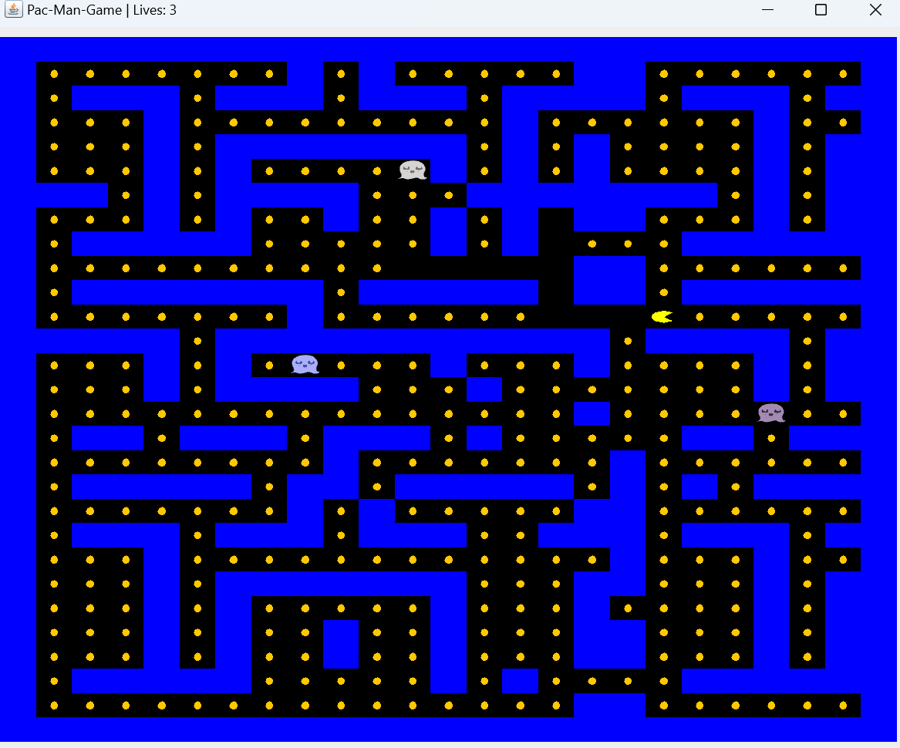

# Pac-Man Game

A Java-based implementation of the classic **Pac-Man** game, showcasing object-oriented principles, multi-threading, design patterns and GUI.

---

## Features

1. **Game Mechanics:**
   - Control Pac-Man using arrow keys to navigate the board.
   - Ghosts move independently as threads, appearing and disappearing randomly.
   - A player can score points along their route and be disqualified by touching a ghost.

2. **Design Patterns:**
   - **Singleton:** Ensures a single player in each game to control the game logic.
   - **Prototype:** Allows cloning of game objects, such as ghosts, to enable efficient object creation.
   - **Callback:** Implements event-driven logic for player interactions and game updates.
   - **State:** Manages the player's behavior based on their current state, with each state defining unique actions the player can perform (e.g., having lives, being game-over) dynamically.

3. **Multi-threading:**
   - Each ghost operates as a separate thread, ensuring non-blocking movement.
   - Smooth player and ghost animations for an engaging user experience.

4. **Graphical User Interface:**
   - A user-friendly interface built with Java Swing.
   - Supports resizing and dynamic rendering of game elements.

---

## Installation

1. **Clone the Repository**
   ```bash
   git clone https://github.com/hodayaShirazie/Pack-man-game.git
   ```

2. **Compile the Code**
   Ensure you have Java JDK installed (version 11 or higher).
   ```bash
   javac -d bin src/*.java
   ```

3. **Run the Game**
   ```bash
   java -cp bin Frame
   ```

---
## How it works
The player starts with 3 lives. Each time the player touches a ghost, one life is lost.
The goal is to collect all the coins on the board, with each coin worth 5 points.

- Win Condition: Collect all coins while still having lives remaining.
- Lose Condition: Lose all lives before collecting all the coins.

---

## Screenshot



---

## Contributions

Contributions are welcome! Feel free to open issues or submit pull requests to improve the game.

---

## License

This project is licensed under the [MIT License](LICENSE).

---

Enjoy playing Pac-Man while exploring software design principles! 🎮
